# Assignment 3 — Production Maintenance Drill (OPS Checklist)

Part of the DevOps Micro Internship (DMI) Cohort 3 with Agentic AI

---

## Purpose

In this assignment, you will treat your already deployed React application (on Ubuntu VM with Nginx) as a live production system. You will perform structured operational checks covering network validation, service health, log analysis, resource monitoring, configuration verification, and incident simulation with recovery — mirroring real on-call DevOps responsibilities.

---

# Task 1 — Server Access & Networking Validation

## Goal

Verify that the deployed React application is reachable from the browser and confirm basic network connectivity of the Ubuntu VM.

### Evidence

#### Screenshot 1 — Browser showing the React app with your Full Name visible on the UI

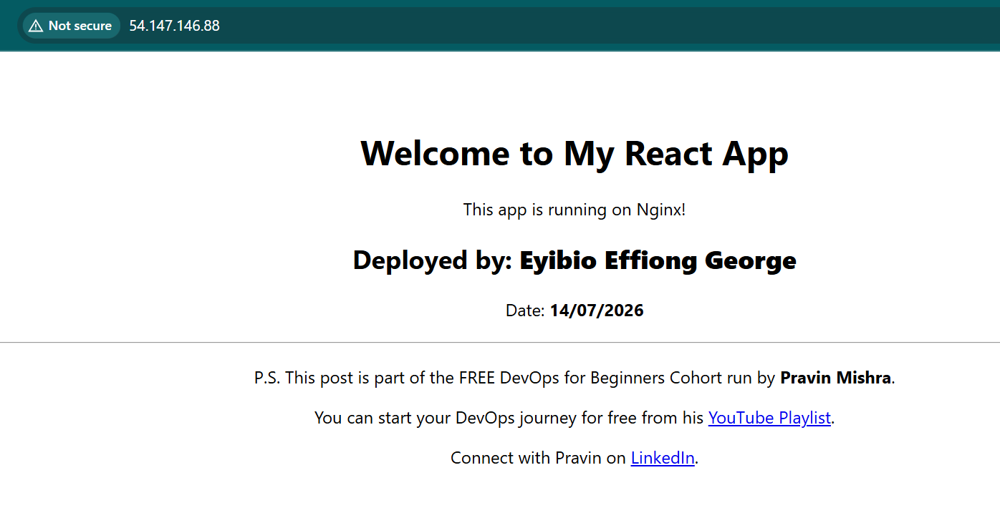

---

#### Screenshot 2 — Output of `ip a`

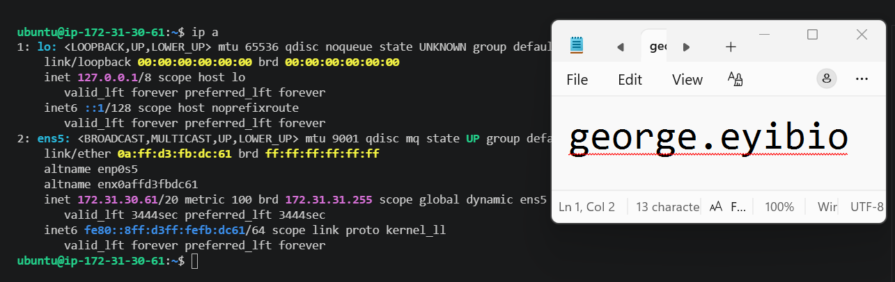

---

#### Screenshot 3 — Output of `sudo ss -tulpen`

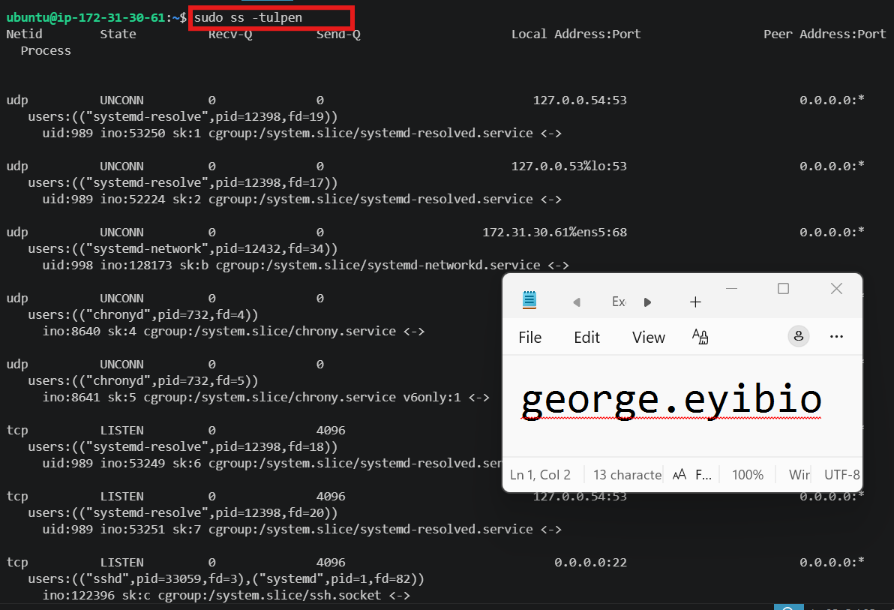

---

#### Screenshot 4 — Output of `sudo ufw status`

,("nginx",pid=28889,fd=5),("nginx",pid=28888,fd=5))                                ino:97808 sk:9 cgroup:/system.slice/nginx.service <->                                                                            

---

**2. What proves SSH is active on port 22?**

tcp LISTEN  0   4096    0.0.0.0:22  0.0.0.0:*   users:(("sshd",pid=33059,fd=3),("systemd",pid=1,fd=82)) 
ino:122396 sk:c cgroup:/system.slice/ssh.socket <->                        

---

**3. Did you find any unexpected open ports? Explain briefly.**

Port 53 is the default digital gateway assigned to the Domain Name System (DNS)
Port 323 is primarily used for UDP network time synchronization and Resource Public Key Infrastructure (RPKI)

---

# Task 2 — Service Health & Systemd Validation (Nginx)

## Goal

Verify that Nginx is properly installed, running, enabled at boot, and safely configured.

### Evidence

#### Screenshot 1 — Output of `systemctl status nginx --no-pager`

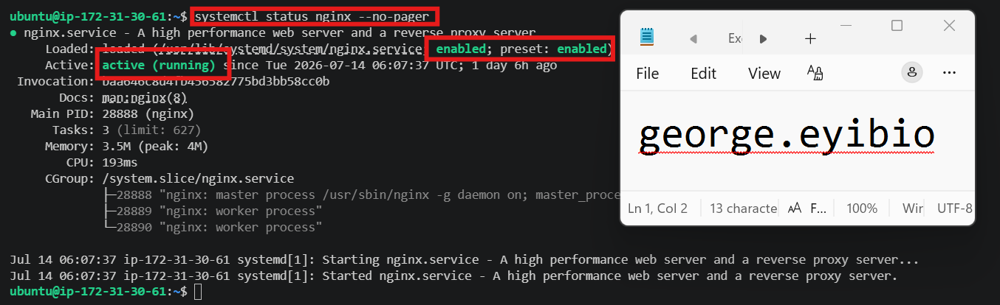

---

#### Screenshot 2 — Output of `sudo nginx -t`

---

#### Screenshot 3 — Output of `sudo ss -lptn '( sport = :80 )'`

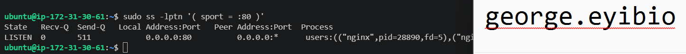

---

### Notes

Answer the following in your own words:

**1. What happens if Nginx fails to restart in production?**

If **Nginx fails to restart in production,** the impact depends on whether the service stops completely or the restart simply fails while the old process is still running.

### Common outcomes include:

+ **Website or application downtime:** If Nginx stops and cannot restart, users will be unable to access the application, resulting in errors such as **502 Bad Gateway, 503 Service Unavailable**, or connection failures.

+ **Service disruption:** Nginx will no longer serve web pages, static files, or reverse proxy requests to backend applications.
Loss of new connections: Existing connections may be dropped, and new client requests will fail until Nginx is running again.

+ **Business impact:** Downtime can lead to lost revenue, reduced user trust, and missed service-level agreements (SLAs).

### Common reasons for a failed restart

- Syntax errors in the Nginx configuration (nginx.conf or site configuration files)
-  Port 80 or 443 already in use by another process
- Invalid SSL certificate or key paths
- Missing configuration files or incorrect permissions
Resource limitations (memory, disk space, etc.)

### Best practice

Before restarting Nginx, always validate the configuration:

`sudo nginx -t`

If the test passes, reload or restart Nginx:

`sudo systemctl reload nginx`

or

`sudo systemctl restart nginx`

Using reload instead of restart is generally safer in production because it applies configuration changes without interrupting existing connections, provided the configuration is valid.

---

**2. What's your basic rollback plan?**

A basic rollback plan for an Nginx deployment is:

1. **Identify the issue** by checking the Nginx status and logs.
2. **Restore the previous working configuration** from a backup or version control (Git).
3. **Test the restored configuration** before applying it:

   `sudo nginx -t`

4. **Reload or restart Nginx** to apply the known-good configuration:

   `sudo systemctl reload nginx`

   or

    `sudo systemctl restart nginx`

5. **Verify the service* by checking:

    - Nginx status:

      `sudo systemctl status nginx`
    - Website accessibility in a browser or with:

      `curl http://localhost`
6. **Investigate and fix the root cause** before attempting the deployment again.

---

# Task 3 — Logs & Request Trace

## Goal

Verify real traffic flow and analyze logs to understand system behavior and errors.

### Evidence

#### Screenshot 1 — Output of `sudo tail -n 30 /var/log/nginx/access.log`

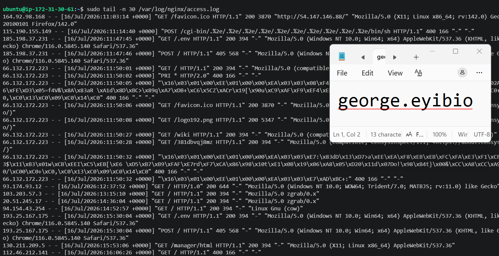

---

#### Screenshot 2 — Output of `sudo tail -n 30 /var/log/nginx/error.log`

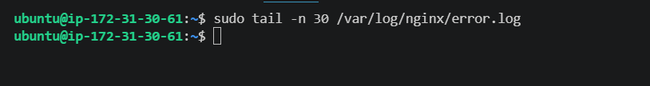

---

#### Screenshot 3 — Output of `sudo journalctl -u nginx --no-pager -n 50`

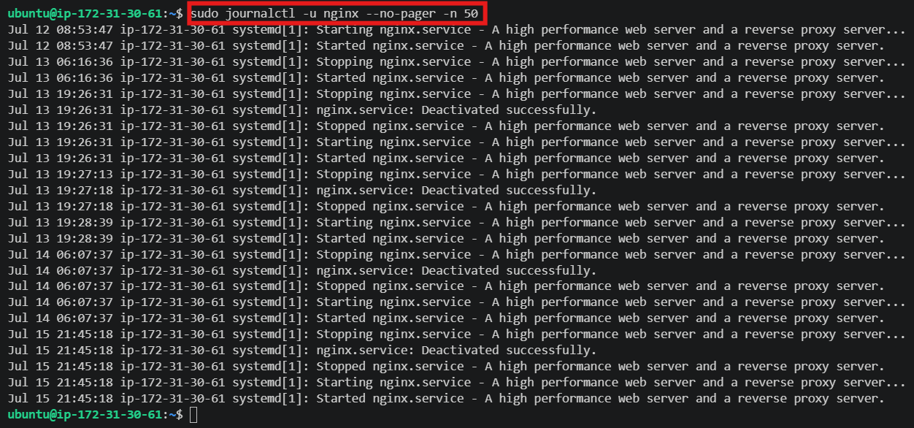

---

### Notes

Answer the following in your own words:

**1. Were there any errors in the logs?**

- If yes, mention 1–2 example error lines from the logs and explain what each one means in simple terms.
- If no, explain what it means if the error log is empty or shows no recent errors during your check.

No, it means there are no recent errors recorded in the Nginx error log and Nginx is running without problems.

---

**2. If there were no errors, what does that indicate about the system?**

Nginx is fine

---

**3. Based on the access logs, were your curl requests visible in the log entries? What does that prove about traffic flow?**

The curl requests successfully reached the EC2 instance, Nginx received and processed the requests and responded with HTTP 200 OK, meaning the requests were handled successfully. This demonstrates that the traffic flow is working as expected

---

# Task 4 — System Resource Health Check (Capacity Red Flags)

## Goal

Assess server capacity and detect potential performance or failure risks.

### Evidence

#### Screenshot 1 — Output of `uptime`

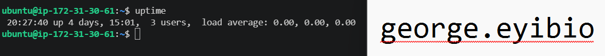

---

#### Screenshot 2 — Output of `free -h`

---

#### Screenshot 3 — Output of `df -h`

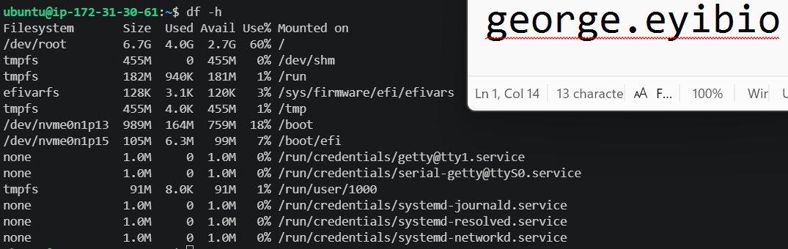

---

#### Screenshot 4 — Output of `sudo du -sh /var/* | sort -h`

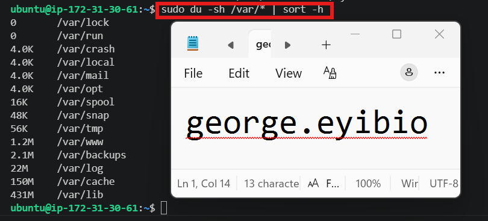

---

### Notes

Answer the following in your own words:

**1. Which resource looks most critical right now? (CPU/load, memory, or disk) Explain why.**

The most critical resource right now is memory (RAM), it has 908 MiB of RAM, with 358 MiB in use and 550 MiB available
While the load average of a CPU is 0.00, 0.00, 0.00, which means the CPU is almost idle and there are no processes waiting for CPU time
And the root filesystem is 60% utilized, leaving 2.7 GB of free space. This is sufficient, and there are no signs of storage pressure.

---

**2. What happens if disk becomes 100% full in a production server?**

If a production server's disk becomes 100% full, applications and system services may fail because they can no longer write files, logs, or temporary data. Web servers such as Nginx may stop logging requests, databases may reject write operations or crash, and users may experience application errors or downtime. System updates and service restarts can also fail. To prevent this, administrators should continuously monitor disk usage, rotate and archive logs, clean up unnecessary files, and configure alerts before disk usage reaches a critical level (for example, 80–90%).

---

# Task 5 — Configuration & Deployment Verification

## Goal

Ensure the correct React build is deployed and Nginx is serving it properly.

### Evidence

#### Screenshot 1 — Output of `ls -lah /var/www/html | head -n 20`

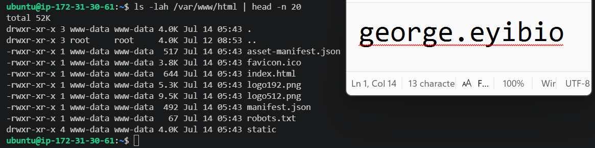

---

#### Screenshot 2 — Output of `grep -R "Deployed by" -n /var/www/html 2>/dev/null | head`

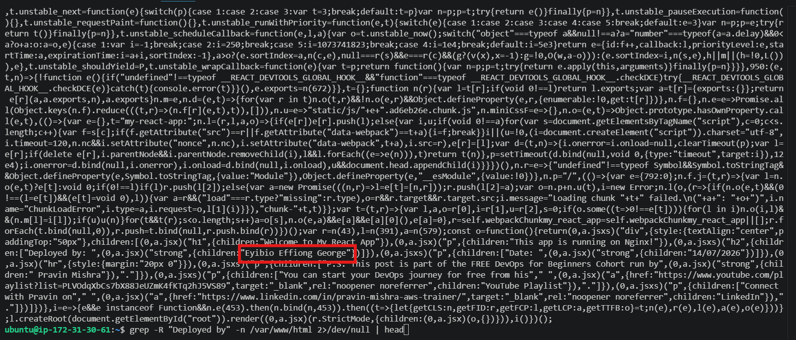

---

#### Screenshot 3 — Output of `grep -n "try_files" /etc/nginx/sites-available/default`

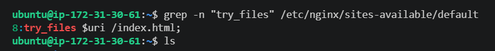

---

### Notes

Answer the following in your own words:

**1. How do you confirm that the correct version of the application is deployed?**

The React production build was successfully deployed to `/var/www/html`, as confirmed by the presence of files such as `index.html`, `asset-manifest.json`, `favicon.ico`, and the static directory. Also custom change is deployed by checking the **Deployed by Eyibio Effiong George**". **The Nginx** configuration includes the directive `try_files $uri /index.html`;, which is required for React Single Page Applications. This directive serves the requested file if it exists; otherwise, it falls back to `index.html`, allowing React Router to handle client-side routes. As a result, users can refresh or directly access routes like `/about` or `/dashboard` without receiving a **404 error**.

---

# Task 6 — Nginx Configuration Failure Simulation

## Goal

Simulate a real-world Nginx misconfiguration and recover the service safely.

### Evidence

#### Screenshot 1 — Output of `sudo nginx -t` showing the syntax error (broken config)

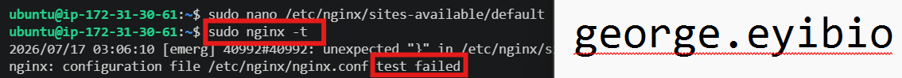

---

#### Screenshot 2 — Output of `sudo nginx -t` showing syntax ok (fixed config)

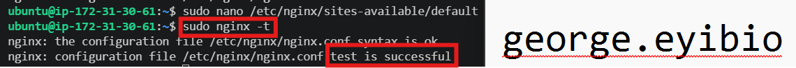

---

#### Screenshot 3 — Output of `curl -I http://<public-ip>` confirming recovery (200 OK)

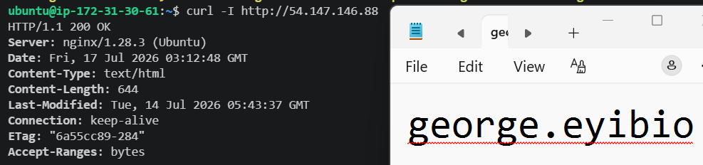

---

### Notes

Answer the following in your own words:

**1. What caused the configuration failure?**

**Omitting semi-colon** when configuring **React Single Page Application (SPA)**

---

**2. How did you fix the issue?**

**Semi-colon was replaced.**

---

**3. How can you avoid this kind of issue in real production systems?**

This type of error can be avoided by carefully checking the syntax of the Nginx configuration, especially ensuring that every directive ends with a semicolon (`;`) and that braces (`{}`) are correctly matched. Before applying changes, I would always run `sudo nginx -t` to validate the configuration. Testing the configuration before restarting or reloading Nginx helps catch syntax errors early and prevents service interruptions. Additionally, making small changes and keeping a backup of the configuration file makes it easier to identify and fix mistakes quickly

---

# Task 7 — Web Application Failure Simulation

## Goal

Simulate missing deployment content and recover the application safely.

### Evidence

#### Screenshot 1 — Output of `curl -I http://<public-ip>` showing failure (non-200 response)

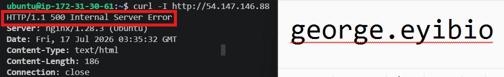

---

#### Screenshot 2 — Output of `curl -I http://<public-ip>` confirming recovery (200 OK)

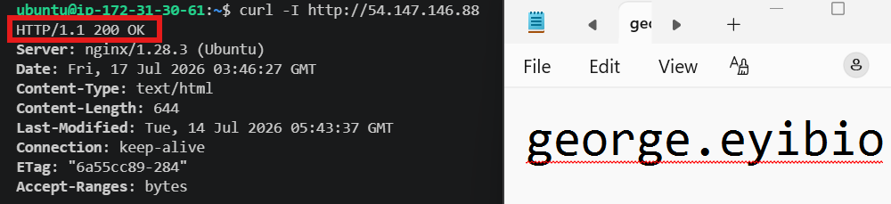

---

### Notes

Answer the following in your own words:

**1. What caused the application to break in this scenario?**

This happened because the required React application files (such as index.html) were no longer present in the document root.

---

**2. How did you fix the issue and restore the application?**

The issue fixed by restoring the original React application files and restarting Nginx

---

**3. What steps would you take to prevent this kind of issue in real production systems?**

To prevent this type of issue in a production environment, I would:

- Back up the current deployment before making any changes so I can quickly roll back if needed.
- Test the application in a staging environment before deploying it to production.
- Verify that all application files are present before switching the live site to the new version.
- Validate the Nginx configuration with sudo nginx -t before reloading or restarting the service.
- Maintain a tested rollback plan, allowing the previous version to be restored immediately if the deployment fails.

---

# Task 8 — Security & Reliability Review

## Goal

Review and reflect on the security and reliability practices applied during this assignment.

### Security & Reliability Notes

Answer the following in your own words:

**1. Why is SSH key-based authentication more secure than sharing passwords?**

SSH key-based authentication is more secure than password authentication because it uses a cryptographic key pair instead of a shared secret. The private key remains on the user's computer and is never sent over the network, making it much harder for attackers to steal or guess.

---

**2. Why should only required ports be open on a production server?**

Only the required ports should be open on a production server to minimize the attack surface and improve security. Each open port exposes a network service that could be targeted by attackers. By allowing only essential ports, such as **22 (SSH)** for secure administration and 8**0 (HTTP)** or **443 (HTTPS)** for web traffic, the risk of unauthorized access and exploitation is significantly reduced. Closing unnecessary ports follows the principle of least privilege and helps keep the production environment more secure.

---

**3. Why is it important for Nginx to be enabled on boot?**

Nginx should be enabled on boot so that it starts automatically whenever the server restarts. This ensures that the website or application becomes available without requiring manual intervention, reducing downtime and improving service reliability. In production environments, enabling Nginx on boot is a best practice because it supports automatic recovery after system reboots, maintenance, or unexpected failures, helping maintain continuous availability for users.

---

**4. What are the risks of sharing secrets, keys, or credentials publicly?**

Sharing secrets, **API keys**, **SSH keys**, or **credentials** publicly is a major security risk because it can allow unauthorized users to access systems and sensitive data. Exposed credentials may be used to compromise servers, steal information, disrupt services, or create unauthorized cloud resources, leading to financial losses. They can also damage an organization's reputation and result in compliance violations. To prevent these risks, secrets should never be committed to public repositories or shared openly. Instead, they should be stored securely using environment variables, secret management services, or encrypted vaults, and rotated immediately if they are accidentally exposed.

---

**5. Why should cloud resources be stopped or terminated when they are no longer needed?**

Cloud resources should be stopped or terminated when they are no longer needed to avoid unnecessary costs and improve security. Running resources such as **EC2 instances** continue to incur charges, even if they are idle. Unused resources can also increase the attack surface and become difficult to manage over time. By stopping or terminating them, organizations reduce cloud costs, minimize security risks, and keep their cloud environment clean and efficient.

---

# LinkedIn Post (Required)

## Evidence

#### LinkedIn Post URL

Paste your LinkedIn post URL here:

<<<<<<< HEAD
`https://www.linkedin.com/posts/effiong-eyibio-58207286_%F0%9D%97%AA%F0%9D%97%B2%F0%9D%97%B2%F0%9D%97%B8-%F0%9D%9F%AC%F0%9D%9F%AF-%F0%9D%91%83%F0%9D%91%8E%F0%9D%91%9F%F0%9D%91%A1-2-%F0%9D%97%A3%F0%9D%97%BF%F0%9D%97%BC%F0%9D%97%B1%F0%9D%98%82%F0%9D%97%B0%F0%9D%98%81%F0%9D%97%B6%F0%9D%97%BC%F0%9D%97%BB-ugcPost-7483744155408568320-5f4S/?utm_source=share&utm_medium=member_desktop&rcm=ACoAABIpp7IB2uLQWBwAPAfjOt0Din_uqvLdTAQ`
=======
`Add your URL here`
>>>>>>> upstream/main

---

#### Screenshot — Published LinkedIn post

Add your screenshot here.

---

# Submission Instructions

- Add all required screenshots in your submission
- Full name must be visible in required screenshots
- Do not expose sensitive information (keys, passwords, account IDs)

---

# Completion Checklist

- [ ] Task 1: Screenshots (browser, ip a, ss -tulpen, ufw status) + Notes answered
- [ ] Task 2: Screenshots (nginx status, nginx -t, ss port 80) + Notes answered
- [ ] Task 3: Screenshots (access log, error log, journalctl) + Notes answered
- [ ] Task 4: Screenshots (uptime, free -h, df -h, du -sh) + Notes answered
- [ ] Task 5: Screenshots (ls html, grep deployed by, grep try_files) + Notes answered
- [ ] Task 6: Screenshots (nginx -t fail, nginx -t pass, curl recovery) + Notes answered
- [ ] Task 7: Screenshots (curl failure, curl recovery) + Notes answered
- [ ] Task 8: Security & Reliability Notes answered
- [ ] LinkedIn post published and URL submitted
- [ ] Full Name visible in all required screenshots
- [ ] No sensitive data exposed

---

## 📌 About DMI & CloudAdvisory

DevOps Micro Internship (DMI) is a project-based DevOps program run by Pravin Mishra (The CloudAdvisory) focused on real-world execution, systems thinking, and career readiness.

It helps learners build strong DevOps foundations with hands-on experience.

---

## 📌 Resources

- 🌐 DMI Official Website: https://pravinmishra.com/dmi  
- 🎓 DevOps for Beginners (Udemy): https://www.udemy.com/course/devops-for-beginners-docker-k8s-cloud-cicd-4-projects/  
- 🎓 Agentic AI DevOps with Claude Code: https://www.udemy.com/course/ultimate-agentic-ai-devops-with-claude-code/  
- 🎓 DevOps with Claude Code: Terraform, EKS, ArgoCD & Helm: https://www.udemy.com/course/devops-with-claude-code-terraform-eks-argocd-helm/  
- ▶️ YouTube Playlist: https://www.youtube.com/playlist?list=PLFeSNDtI4Cho  
- 🔗 Pravin Mishra (LinkedIn): https://www.linkedin.com/in/pravin-mishra-aws-trainer/  
- 🏢 CloudAdvisory (LinkedIn): https://www.linkedin.com/company/thecloudadvisory/

---

*This submission is part of DevOps Micro Internship (DMI) Cohort 3 — Agentic AI Track.*