# Assignment 5 — Bash Script Automation Drill (OPS Checklist)

Part of the DevOps Micro Internship (DMI) Cohort 3 with Agentic AI

---

## Purpose

In this assignment, you will practice Bash scripting by building a series of small automation scripts covering environment setup, variables, arrays, loops, file conditionals, if-else logic, and functions. These scripts form the foundation of real-world Linux automation used in DevOps, cloud, and production support environments.

---

# Task 1 — Bash Environment & Workspace Setup

## Goal

Verify that Bash is available on your system and create a clean workspace for this assignment.

### Evidence

#### Screenshot 1 — Output of `echo $SHELL` and `bash --version`

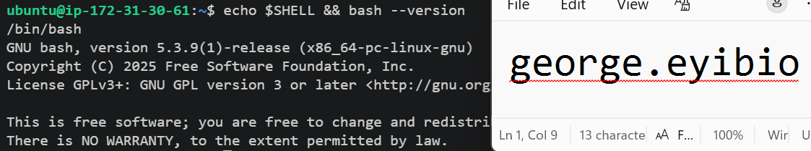

---

#### Screenshot 2 — Output of `pwd` and `ls -lah` showing the scripts directory

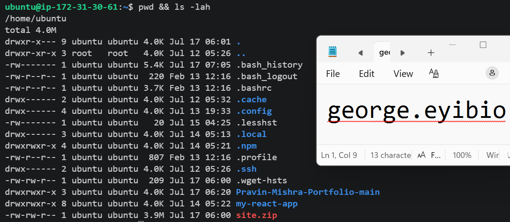

--- 

### Notes

Answer the following in your own words:

**1. What is Bash?**

**Bash (Bourne Again SHell)** is a command-line shell and scripting language used on Linux and Unix systems. It enables users to execute commands, manage files and directories, administer systems, and automate repetitive tasks through scripts. Bash is widely used by system administrators, DevOps engineers, and developers because it simplifies system management and improves efficiency through automation.

---

**2. What is the difference between shell and Bash?**

A **shell** is a command-line interface that allows users to interact with the operating system by executing commands. Bash (**Bourne Again SHell**) is a specific type of shell and is one of the most commonly used on Linux systems. While there are several types of shells, such as `sh`, `zsh`, `ksh`, and `fish`, Bash is popular because it offers advanced features like command history, tab completion, aliases, and powerful scripting capabilities.

---

**3. Why is it important to confirm the Bash version before writing scripts?**

It is important to confirm the Bash version before writing scripts because different versions of Bash support different features and syntax. Verifying the version ensures that the script is compatible with the target system, helps prevent execution errors, and makes troubleshooting easier if the script behaves differently on another machine. This is especially important when deploying scripts across multiple Linux environments.

---

# Task 2 — Your First Bash Script

## Goal

Create your first Bash script, make it executable, and run it from the terminal.

### Evidence

#### Screenshot 1 — Content of `first-script.sh`

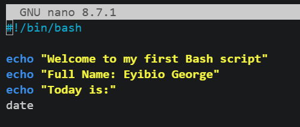

---

#### Screenshot 2 — Output of `./first-script.sh`

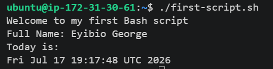

---

#### Screenshot 3 — Output of `ls -l first-script.sh` showing executable permission

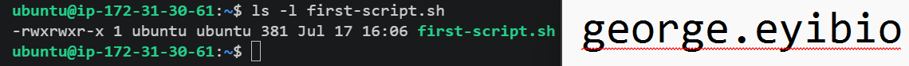

---

### Notes

Answer the following in your own words:

**1. What is the purpose of `#!/bin/bash`?**

The line #!/bin/bash is called the shebang (or hashbang). It tells the operating system which interpreter should be used to execute the script.

---

**2. Why do we use `chmod +x` before running a script?**

We use chmod +x to give a script execute permission, allowing the operating system to run it as a program.

---

**3. What is the difference between running a script using `./script.sh` and `bash script.sh`?**

The command ./script.sh executes the script directly and requires the script to have execute permission (chmod +x). It also uses the interpreter specified in the script's shebang (for example, #!/bin/bash). In contrast, bash script.sh explicitly runs the script with the Bash interpreter and does not require execute permission, only read permission. This makes bash script.sh useful for testing or running scripts without modifying their permissions.

---

# Task 3 — Variables: User Information Script

## Goal

Use variables to store and display user-related information.

### Evidence

#### Screenshot 1 — Content of `user-info.sh`

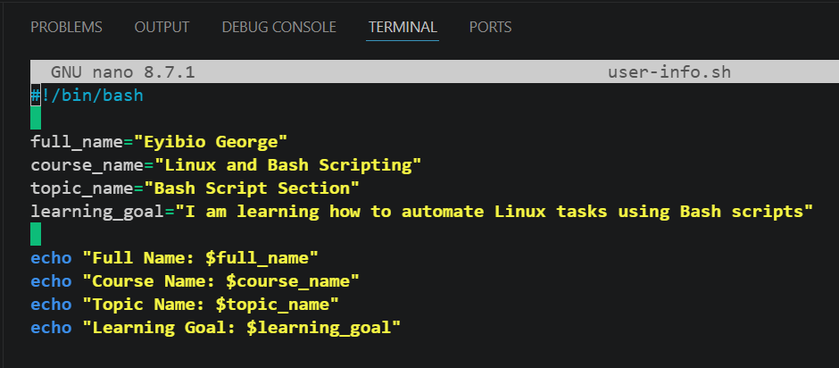

---

#### Screenshot 2 — Output of `./user-info.sh`

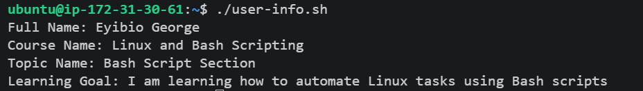

---

### Notes

Answer the following in your own words:

**1. What is a variable in Bash?**

A variable in Bash is a named container used to store a value, such as text, numbers, or the output of a command. Variables make scripts more flexible by allowing you to store and reuse data instead of hardcoding values.

---

**2. Why should we avoid spaces around the `=` sign when creating variables?**

In Bash, spaces are not allowed around the `=` sign when assigning a value to a variable because the shell interprets spaces as separators between commands and arguments.

---

**3. How do you access the value stored inside a Bash variable?**

You access the value stored inside a Bash variable by placing a dollar sign `($)` before the variable name.

# Task 4 — Arrays & Loops: Tools Checklist Script

## Goal

Use arrays and loops to print a checklist of tools used in Bash scripting.

### Evidence

#### Screenshot 1 — Content of `tools-checklist.sh`

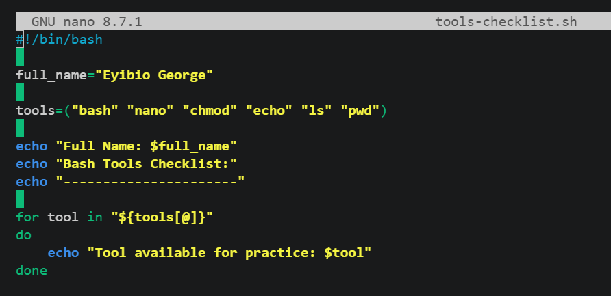

---

#### Screenshot 2 — Output of `./tools-checklist.sh`

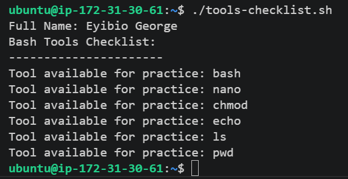

---

### Notes

Answer the following in your own words:

**1. What is an array in Bash?**

An array in Bash is a variable that stores multiple values in a single variable. Each value is assigned an index starting from 0, allowing individual elements to be accessed using their index. Arrays are useful for managing lists of related data, such as filenames, users, or server names, making Bash scripts more organized and efficient.

---

**2. Why are arrays useful in scripts?**

Arrays are useful in Bash scripts because they allow multiple related values to be stored in a single variable. This makes it easier to process lists of items using loops, reduces repetitive code, improves script readability, and simplifies maintenance. Arrays are commonly used in automation tasks, such as managing multiple files, servers, or user accounts, making Bash scripts more efficient and scalable.

---

**3. What does `"${tools[@]}"` mean?**

`"${tools[@]}"` is a Bash expression that represents **all the elements** of the tools **array**.

---

**4. What is the purpose of the `for` loop in this script?**

The purpose of the `for loop` in this script is to iterate through each element in the `tools array` and display it one at a time.

---

# Task 5 — Loops: Number Counter Script

## Goal

Use loops to repeat a task multiple times.

### Evidence

#### Screenshot 1 — Content of `counter.sh`

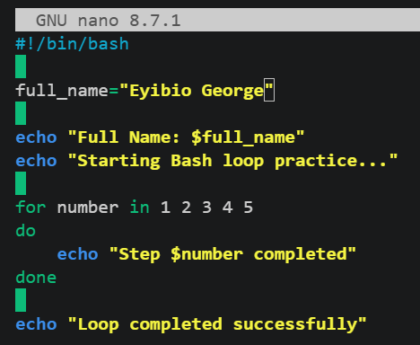

---

#### Screenshot 2 — Output of `./counter.sh`

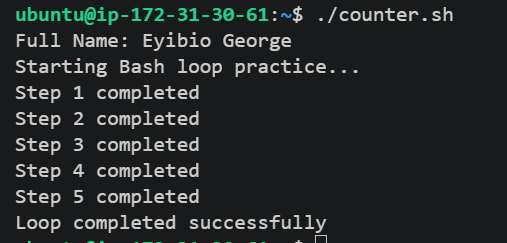

---

### Notes

Answer the following in your own words:

**1. What is a loop?**

A loop is a programming structure that repeatedly executes a block of code until a specified condition is met or all items have been processed.

---

**2. Why do we use loops in Bash scripting?**

Loops are used in Bash scripting to automate repetitive tasks by executing the same block of code multiple times.

---

**3. How many times did the loop run in your script?**

5 times

---

**4. What would you change if you wanted the loop to run 10 times?**

increase the counter from 1 to 10

---

# Task 6 — Files & Conditionals: File Validation Script

## Goal

Use file checks and conditionals to verify whether files and directories exist.

### Evidence

#### Screenshot 1 — Output of `ls -lah ../test-folder`

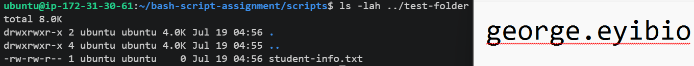

---

#### Screenshot 2 — Content of `file-check.sh`

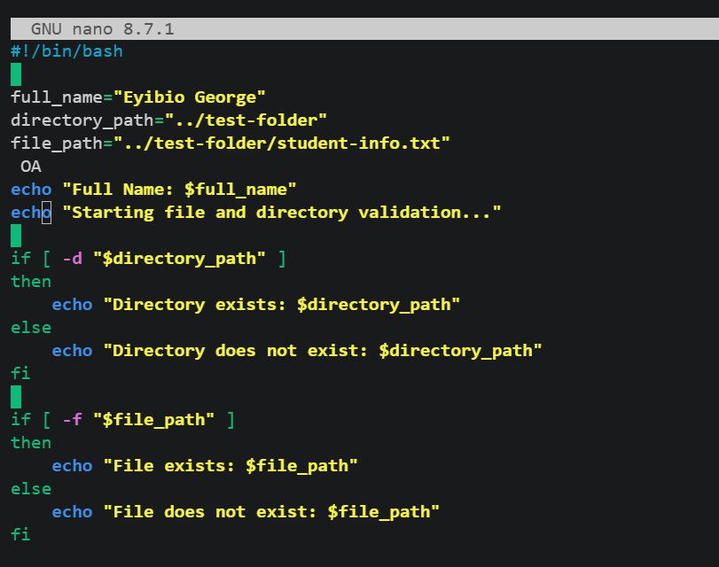

---

#### Screenshot 3 — Output of `./file-check.sh`

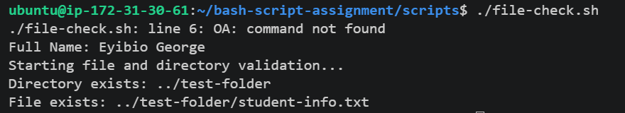

---

### Notes

Answer the following in your own words:

**1. What does `-d` check in Bash?**

`-d` is use to check whether the directory exists

---

**2. What does `-f` check in Bash?**

`-f` is use to check whether the file exists.

---

**3. Why should file and directory paths be stored in variables?**

Storing `file and directory paths in variables` makes Bash scripts more flexible, readable, and easier to maintain.

---

**4. What happens if the file does not exist?**

If the `file does not exist,` the condition using `-f` evaluates to `false`, so the else `block` is executed.

---

# Task 7 — Conditionals: Pass or Retry Script

## Goal

Use if-else conditionals to make decisions based on a variable value.

### Evidence

#### Screenshot 1 — Content of `score-check.sh` with `score=85`

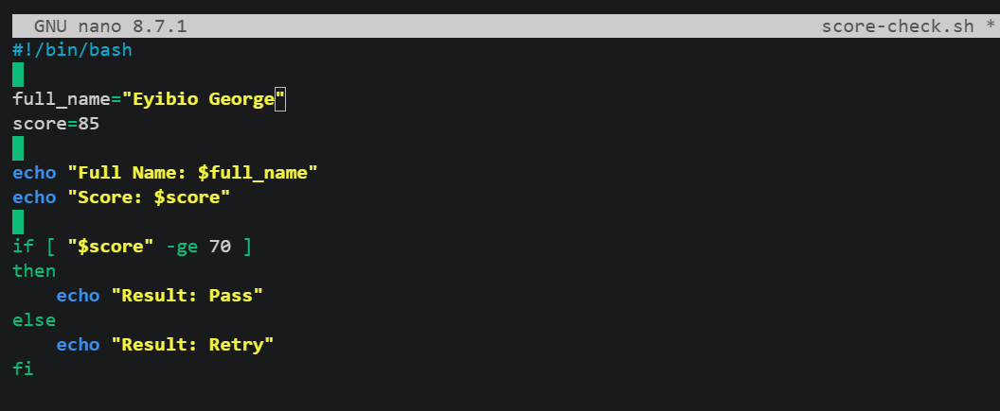

---

#### Screenshot 2 — Output showing `Result: Pass`

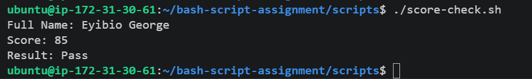
---

#### Screenshot 3 — Content of `score-check.sh` with `score=55`

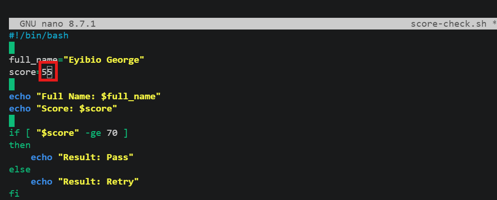

---

#### Screenshot 4 — Output showing `Result: Retry`

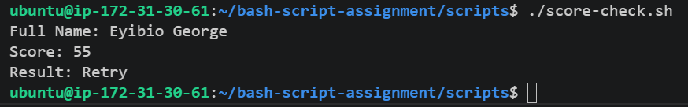

---

### Notes

Answer the following in your own words:

**1. What is the purpose of if-else in Bash?**

The **`if-else` statement** in Bash is used to **make decisions** based on whether a condition is true or false. It allows a script to execute different blocks of code depending on the result of a test.

---

**2. What does `-ge` mean?**

In Bash, `-ge` means `"greater than or equal to."`

---

**3. Why should conditions be tested with different values?**

Conditions should be **tested with different values** to ensure that a Bash script behaves correctly in all possible scenarios. This helps identify errors, verify the logic, and make the script more reliable.

---

**4. How can conditionals help in automation scripts?**

Conditionals help in automation scripts by allowing the script to **make decisions **based on specific conditions. Instead of always performing the same actions, the script can respond differently depending on the current situation.

---

# Task 8 — Functions: Final Bash Automation Script

## Goal

Create a final Bash script using functions to organize reusable code.

### Evidence

#### Screenshot 1 — Content of `final-automation.sh`

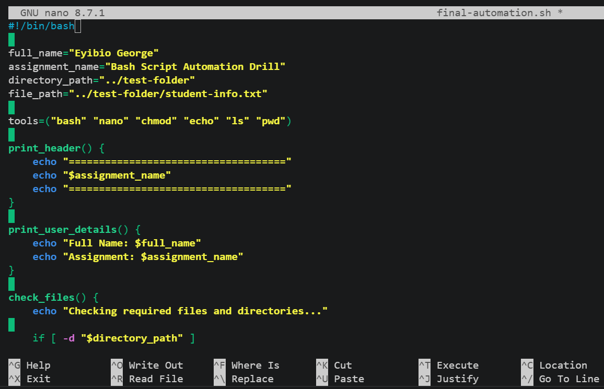

---

#### Screenshot 2 — Output of `./final-automation.sh`

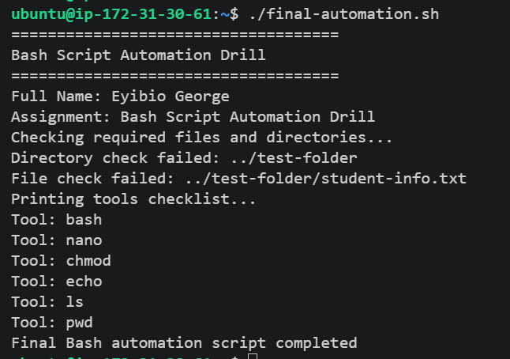

---

#### Screenshot 3 — Output of `ls -lah` showing all created scripts

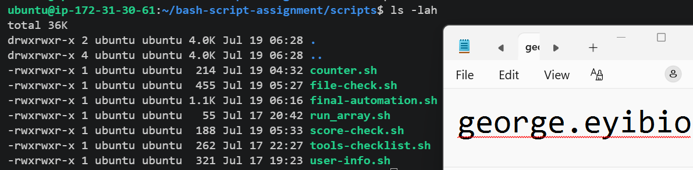

---

### Notes

Answer the following in your own words:

**1. What is a function in Bash?**

A **function** in Bash is a **named block of code** that performs a specific task. Instead of writing the same commands multiple times, you can place them inside a function and call the function whenever you need it.

---

**2. Why are functions useful in scripts?**

Functions are useful in Bash scripts because they allow related commands to be grouped into reusable blocks. This reduces code duplication, improves readability, simplifies maintenance, and makes scripts more modular. By defining a function once and calling it whenever needed, Bash scripts become easier to manage, debug, and extend.

---

**3. Which functions did you create in this script?**

- print_header()
- print_user_details()
- check_files()
- print_tools()

---

**4. How does this final script combine variables, arrays, loops, conditionals, files, and functions?**

he final script modularizes the code by organizing it into separate functions, with each function responsible for a specific task. The functions are then called in the appropriate order to execute the complete automation workflow.

---

# LinkedIn Post (Required)

## Evidence

#### LinkedIn Post URL

Paste your LinkedIn post URL here:

`__________________________`

---

#### Screenshot — Published LinkedIn post

Add your screenshot here.

---

# Submission Instructions

- Add all required screenshots in your submission
- Full name must be visible in required screenshots
- All script files must be created and run successfully
- Required notes must be answered clearly for every task
- Do not expose sensitive information (keys, passwords, credentials)

---

# Completion Checklist

- [ ] Task 1: Environment setup verified, workspace created (Screenshots 1–2, Notes answered)
- [ ] Task 2: First script created, executed, permissions verified (Screenshots 1–3, Notes answered)
- [ ] Task 3: Variables script created and run (Screenshots 1–2, Notes answered)
- [ ] Task 4: Arrays and loops script created and run (Screenshots 1–2, Notes answered)
- [ ] Task 5: Counter loop script created and run (Screenshots 1–2, Notes answered)
- [ ] Task 6: File validation script created and run (Screenshots 1–3, Notes answered)
- [ ] Task 7: Pass/Retry conditional script tested with both values (Screenshots 1–4, Notes answered)
- [ ] Task 8: Final automation script created and run (Screenshots 1–3, Notes answered)
- [ ] All scripts run without errors
- [ ] Full Name visible in all required screenshots
- [ ] LinkedIn post published and URL submitted
- [ ] No sensitive data exposed

---

## 📌 About DMI & CloudAdvisory

DevOps Micro Internship (DMI) is a project-based DevOps program run by Pravin Mishra (The CloudAdvisory) focused on real-world execution, systems thinking, and career readiness.

It helps learners build strong DevOps foundations with hands-on experience.

---

## 📌 Resources

- 🌐 DMI Official Website: https://pravinmishra.com/dmi  
- 🎓 DevOps for Beginners (Udemy): https://www.udemy.com/course/devops-for-beginners-docker-k8s-cloud-cicd-4-projects/  
- 🎓 Agentic AI DevOps with Claude Code: https://www.udemy.com/course/ultimate-agentic-ai-devops-with-claude-code/  
- 🎓 DevOps with Claude Code: Terraform, EKS, ArgoCD & Helm: https://www.udemy.com/course/devops-with-claude-code-terraform-eks-argocd-helm/  
- ▶️ YouTube Playlist: https://www.youtube.com/playlist?list=PLFeSNDtI4Cho  
- 🔗 Pravin Mishra (LinkedIn): https://www.linkedin.com/in/pravin-mishra-aws-trainer/  
- 🏢 CloudAdvisory (LinkedIn): https://www.linkedin.com/company/thecloudadvisory/

---

*This submission is part of DevOps Micro Internship (DMI) Cohort 3 — Agentic AI Track.*